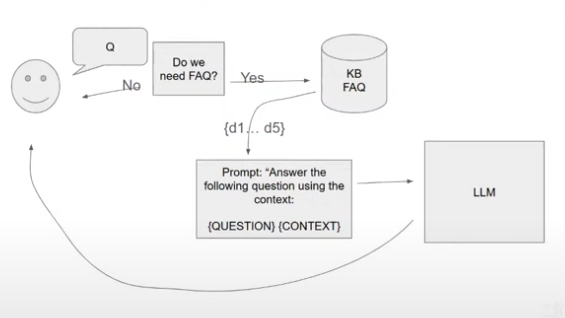

### Agents

Observe it's environment and perform a task  or (actions), they also have memory of previous interaction with it's environment.

### example - Agentic-rag

#### scenario

- we are trying to make our system decide whether or not it needs the  knowledge DB or just use llm to answer query (do a certain task).

    for example in FAQ, it decides weather it needs what we stored in Elasticsearch or not

    

### how can this be implemented ?

- For our FAQ, we can simply edit our prompt.

### Agentic Search

