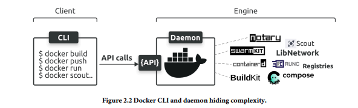

# Docker 
##### Before going to docker it's important to understand Virtual Machine.

## 🌐 **What is a Virtual Machine (VM)?**

### 🚩 **`Why Do We Even Need a Virtual Machine`?**

Imagine you only have **one computer**, but you want to:

- Try **Linux** while using **Windows**.
- **Experiment** with software or settings that might break your system.
- Learn about servers, networks, or hacking without messing up your real system.

Normally, you'd need **multiple computers**. That’s expensive, slow, and unrealistic.

💡 **Virtual Machines** solve this. They let you run **many computers inside one computer** — like magic.

### 🧠 **`What is a Virtual Machine, Really`?**

A `Virtual Machine` (VM) is a computer inside your computer.

It’s **not fake** — it behaves like a real one. It has:

- Its **own operating system** (like Ubuntu Linux),
- Its own **`storage`**, **`RAM`**, and even a **`fake CPU`**,
- And it runs in a **window** on your main computer.

You're basically **pretending to have a whole new computer** — without buying one.

🖥️ Example:

- You're on a Windows laptop.
- You open a program like **VirtualBox**.
- Inside it, you open **Ubuntu Linux** — like opening Chrome or Word.

Now you’re using two computers at once. 🎉

#### 🔧 **`How Do Virtual Machines Work?`**

To run a virtual machine, you need:

1. **`A physical computer`** (the real one you own) → this is called the **host**.
2. **`Virtualization software (Hypervisor)`**  → this is a special app that helps you create and run VMs.
    - Examples: **VirtualBox**, **VMware**, **Parallels**.
3. **`An ISO file`** of the `OS` you want to install → like Ubuntu’s installer.

#

### Here's what happens:

- You install **VirtualBox** on your Windows.
- You tell VirtualBox: “Hey, create a fake computer with 4GB RAM and 30GB storage.”
- You install Ubuntu inside that fake computer.
- Boom! Now Ubuntu is running in a window — inside your real Windows computer.

The VM has **no idea** it’s not real. It thinks it’s a full PC.

## 🛡️ **Why Are VMs So Cool?**

Let’s break it down:

| Benefit | Why It Matters |
| --- | --- |
| 🧪 Try Anything Safely | Break stuff, learn, test — your real computer is safe. |
| 🧠 Learn New OSes | Use Linux, Windows, or even old systems without dual-boot. |
| 📂 Keep Things Separate | Set up labs, test viruses, or run a web server — without mixing with your real setup. |
| 💾 Snapshots | Save your VM’s state. If you mess up, go back in time. Like checkpoints in a video game. |
| 📦 Portable | Move your VM to another computer like a file. It works the same. |
| 💻 Use Old Software | Got apps that only run on Windows XP? Use a VM. |

## ⚙️ **`What is a Hypervisor? (Simple Explanation)`**

A **`hypervisor`** is the sofwtare **that makes virtual machines possible**.

There are 2 types:

1. **`Type 1 (Bare-metal)`**: Installed directly on the hardware. Used in big servers (like AWS or Microsoft Azure).
2. **`Type 2 (Hosted)`**: Runs inside your normal OS (like Windows). You use this. Example: VirtualBox.

So, VirtualBox is a **Type 2 hypervisor**. It lets you make and run fake computers (VMs) **inside your real one**.

### 🔧 **`Why Virtual Machines (VMs) Aren’t Perfect – “VMwarts” Explained`**

Even though **virtual machines** are a big improvement over running everything directly on one system, they come with their own set of **downsides** — or as this section calls them, *“VMwarts.”*

Let’s walk through these problems one by one:

### 🧱 1. **`Every Virtual Machine Needs Its Own Full Operating System`**

Imagine you want to run 3 different applications in isolation using virtual machines. You’d have to do this:

- Create **3 separate VMs**
- Install **an entire OS** (like Ubuntu or Windows) **on each VM**
- Then install your apps inside each one

That means **each VM is like a full computer** inside your computer.

### ❌ `Why This Is a Problem`

### **`Wasted Resources`**

- Every operating system needs **RAM**, **CPU**, **storage**, and **networking** power — even before it runs any app.
- Instead of spending your machine's power on your *apps*, it’s being used just to keep **multiple full OSs** alive.

### **`More Work to Maintain`**

- Each VM has its own OS.
- So if your OS has bugs or security issues, you need to **patch or update** it.
- Now imagine doing that for **10 or 100 VMs** 😬.

### **`Monitoring Headache`**

- Each VM needs **monitoring**: you have to keep track of its resource usage, errors, logs, etc.
- Again, the more VMs you have, the more complex this becomes.

### **`Slow Boot Time`**

- Because each VM boots an entire operating system, **starting one can take a long time** (compared to apps or containers).

### **`Not Very Portable`**

- A VM image (like `.vmdk` or `.ova`) can be **huge** in size.
- If you move a VM to another machine, it may **not work out of the box** unless that machine supports the same virtual hardware.

---

### 📌 `Summary of VM Drawbacks`:

| Drawback | What It Means |
| --- | --- |
| OS Overhead | Resources used by the OS instead of your app |
| Maintenance | Each OS needs updates and patching |
| Monitoring Complexity | More moving parts to keep track of |
| Slower Start-up | Takes time to boot an OS |
| Poor Portability | Not easy to move or share VMs |

---

### 🚀 Coming Next: Containers

These problems are the **reason containers were invented**.

**`VMs and containers are very different under the hood`**:

- **VMs** virtualize the entire hardware — each VM runs its own full OS on virtual hardware, which makes them heavier and slower but great for running different OSes or fully isolated systems.
- **Containers** virtualize at the OS level — they share the host OS kernel and just isolate the application and its dependencies, making them lightweight, fast, and efficient, but all containers share the same OS kernel.

### `What is a Container?`

- A **container** is like a small, portable box that holds an application and everything it needs to run — like code, libraries, and settings.
- Containers share the **host operating system’s kernel** but keep apps **isolated** from each other.
- Because containers share the OS kernel, they are **lightweight and fast** compared to virtual machines.

---

### `Why Do We Need Containers?`

- Traditional virtual machines run a full OS for each app, which is heavy and uses a lot of resources.
- Containers solve this by **sharing the host OS kernel** but still keeping each app isolated and safe.
- Containers are **easy to move** between different environments (your laptop, servers, cloud) because they include everything the app needs (except the OS kernel).

---

### `How Do Containers Work Across Different Operating Systems?`

- Containers run **directly on the host OS kernel** if it supports the container’s OS (usually Linux).
- On **Linux hosts**, containers run natively using the Linux kernel.
- On **Windows or Mac**, containers that require Linux run **inside a lightweight Linux virtual machine**.
    
    This VM provides the Linux kernel needed, so the container runs smoothly even though the host OS is different.
    
- This means **containers rely on virtual machines only when the host OS lacks the required kernel**.

## `WebAssembly (Wasm)`

is a modern binary instruction set that builds applications that are smaller, faster, more secure, and more portable than containers. You write your app in your favorite language and compile it as a Wasm binary, and it’ll run anywhere you have a Wasm runtime.

However, Wasm apps have many limitations, and we’re still developing many of the standards. As a result, containers remain the dominant model for cloud-native applications.

### **`What about Kubernetes`**

Kubernetes is the industry standard platform for deploying and managing containerized apps.

**`Terminology:`** `A containerized app is an application running as a container.`

# **`Docker`** 

### 🐳 `What is Docker?`

`Docker` is a **`tool that helps you create and run containers`** easily. Think of containers as small, packaged-up versions of your app that can run anywhere — kind of like an app in a box that works the same on any computer.

### 🧩 `Docker Has Two Main Parts:`

### 1. 🧑‍💻 `Docker CLI (Command-Line Interface) — The Client`

- This is what **you interact with**.
- You type commands like `docker run`, `docker build`, etc.
- It’s like your **remote control** for Docker.

### 2. ⚙️ **`Docker Engine — The Server`**

- This is the **actual machine behind the scenes** doing the work.
- It’s like the **robot that listens to your remote control (CLI)** and makes things happen.

### 🧙‍♂️ `What is a **Daemon**?`

A **`daemon`** (pronounced *DEE-muhn*) is just a **background program** that runs quietly behind the scenes and **waits for tasks to do**.

### 🔧 In simple terms:

- It **starts automatically** when your system boots up.
- It **runs without needing your attention**.
- It **waits for requests** and does jobs when asked.

### 🐳 `In Docker`

- It runs in the background.
- It listens for commands from the **Docker CLI**.
- It manages:
    - Running containers
    - Pulling images
    - Building images
    - Networking between containers
    - Volumes (data storage)
    

# The Big Idea of Docker in Summary:

- Docker containers need the **Linux kernel** to work.
- So when you use Docker on **Windows or macOS**, it runs a **small Linux virtual machine (VM)** in the background. This is why VM is useful for docker.
- Your containers run **inside this VM**, not directly on your main OS.
- On **Linux**, Docker runs directly without a VM, since it already has the right kernel.

#

#

## **`The Big Picture`**

- `The Ops Perspective`
- `The Dev perspective`

→ `The Ops Perspective`: focuses on starting, stopping, deleting containers, and executing
commands inside them.

→ `The dev perspective`: focuses more on the application side of things and runs through
taking application source code, building it into a container image, and running it as a
container.

