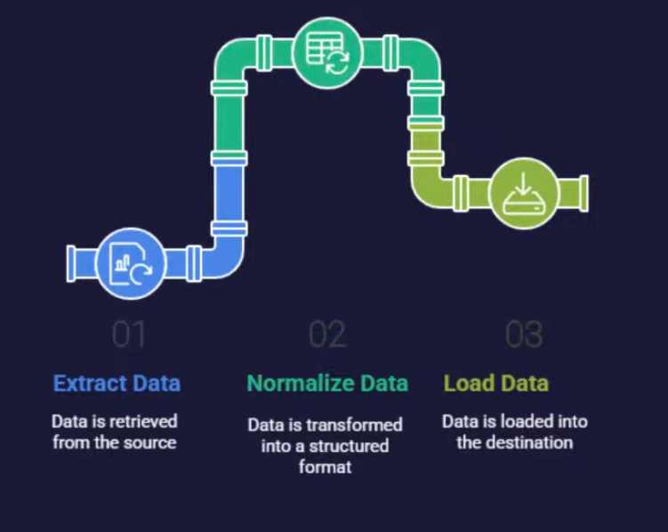
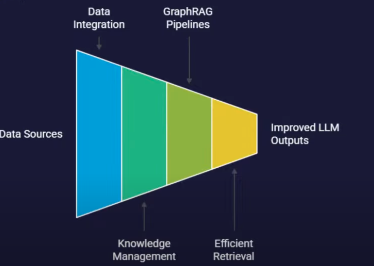
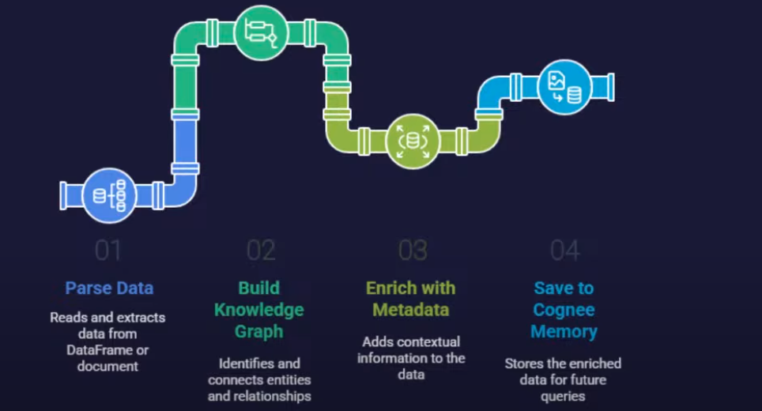
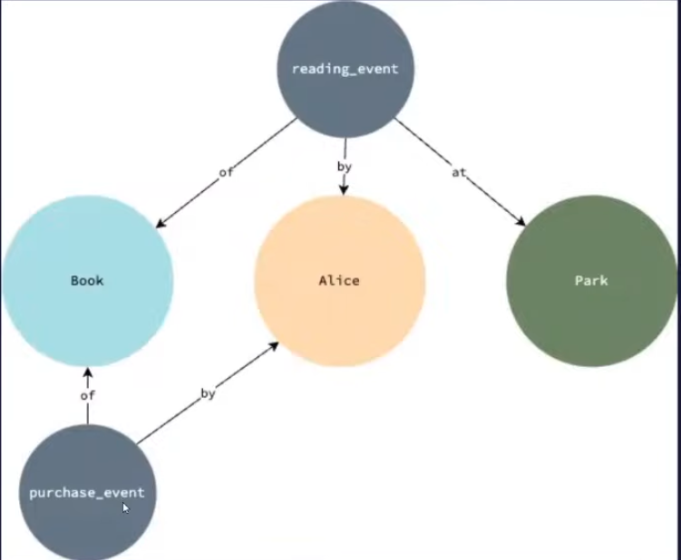

#### what is dlt (Data Load Tool)?

helps take the data from source and move it somewhere else.

 - is opensource python library that lets you build modern ELT pipelines using just python code 
 
It helps you:

a. `Extract` data from APIs, databases, files and cutome sorces
b. `Transform` and normalize data
c. `Load data` into destinations like BigQuery, DuckDB,  Redshift, etc
d. Manage `schemas`, `states`, and `incremental loading` automatically  

`Extract Data -> Normalize Data -> Load Data`

 

main idead of `RAG`:

 

#### What's cognee ?

1. cognee turns your data into a queryable memeory and knowledge graph

2.  It lets you:

    a.  Add structured and unstructured data(DataFrames, documents, tables)

    b.  Automatically build a knowledge graph from it
    c.  Ask natural langauge questions and get grounded, context-rich answers

    > `DLT` is a tool for getting your data from different places. `Qdrant` is a database for storing vector representations of your data. `Cognee` is a framework that helps organize and understand your data by building a knowledge graph and integrating with vector databases like Qdrant. 

##### what happens when you run cognee.

 

`Parse Data -> Build Data Knowledge Graph -> Enrich with Metadata -> Save to Cognee Memory`

Knowledge Graph 

 

### Challenges of `RAG` system

##### Challenge 1

`Challenge` -> `Restrival Quality and Relavance`
- RAG may retrive irrelevant, incomplete, or outdated information, leading to poor or misleading output.

`Cognee's Solution`

- Graph-based retreval uses a semantic graph to identify and connect relevant facts, improving precision and contextual relavance.

##### Challenge 2

`Ranking & Consolidation`

- Retrived chunks are not always ranked by usefulness, leading to suboptimal generation.

`Cognee's Solution`
 
Graph traversal: The graph structure helps prioritize and consolidate the most relavant information for the query 

##### Challenge 3

`Pipeline Scalability and Data Ingestion`
- Scaling ingestion and retrival pipelines for a large datasets is complex and resource-intensive.

`Cognee's Solution`

`LanceDB` and `dlt` integration:

Simplifies local, scalable vector storage and reduces the complexity and reduces complexity in ETL and metadata managment.

#### What are cognee node sets

1. They are lists of tags(strings) attached to content in cognee's knowledge organizing, filtering, and categorizing data.

2. advantages:

    a. `Topic Isolation`: Agents can write/rerieve data by topic, keeping domains separate.

    b. `Better Organization`: Maintains Structure as your knowledge base grows.

    c. `Improve Retrival`: Enables precise, tag-based filtering for searches.

    d. `Topic-based Analysis`: Makes it easy to ananlyze patterns within specific domains.

    e. `Scalabale Knowledge Management`: 
    Reduces complexity as content increases.

    f. Node sets are supported with Kuzu and Neo4j graph databases.

| Use case                                            | Is `dlt` useful? | Why                                  |
| --------------------------------------------------- | ---------------- | ------------------------------------ |
| **Solo dev with a Python script**                   | ❌                | You already control everything       |
| **You load 1 file and embed once**                  | ❌                | No need for incremental tracking     |
| **You have clear data flow already**                | ❌                | `dlt` just repeats what you're doing |
| **You plan to scale to team, cloud, API ingestion** | ✅                | `dlt` makes that clean and safe      |
| **You want retries, audit logs, destinations**      | ✅                | `dlt` helps with those               |
| **You want to plug this into Airflow, dbt, etc.**   | ✅                | `dlt` plays well in that world       |

🧾 TL;DR

❌ If your current Python script already:

- Reads, cleans, embeds, inserts into Qdrant,

A- nd you’re happy running it manually or with cron...

Then you do not need dlt. You're not missing out on anything essential.

✅ But if you later want:

- State tracking across multiple files

- Scheduling across environments

- Built-in schema/version support

- Observability (logs, metrics)

- Modular plug-ins to Postgres, BigQuery, etc.

Then `dlt` might be a smart thing to layer in later, not now.